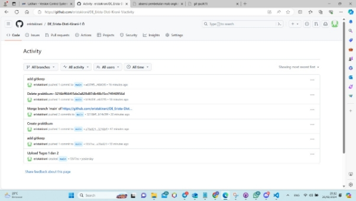

Nama: Erista Disti Kirani 

Tugas Prioritas 1 

Buatlah sebuah repository Github yang sesuai dengan  format namaKelas\_namaKalian 

Jawaban: 

(

Buatlah folder yang berurutan dan diberi nama sesuai dengan nama soal yang kalian kerjakan. contoh penamaan

1. Soal\_GIthub
1. Soal\_Intro\_Algorithm
1. Soal\_Basic\_Programming

seterusnya sesuai dengan nama soal yang kalian kerjakan. buat folder tersebut sampai soal rest API.

(

Pada setiap folder berisi sub folder seperti berikut:

Lakukan commit: 

(

