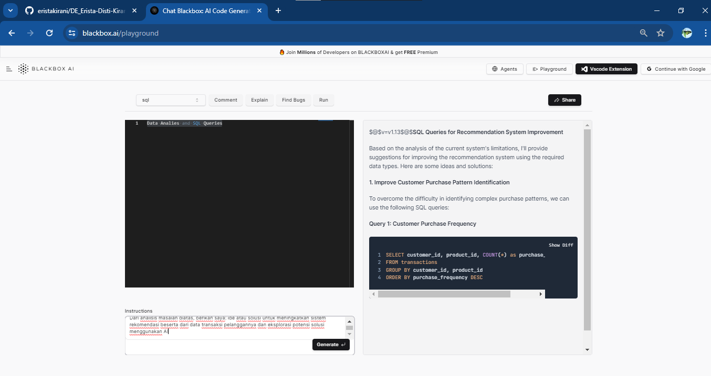

### Soal **Eksplorasi (20)**

Anda bekerja sebagai Data Engineer di sebuah perusahaan e-commerce. Perusahaan Anda ingin meningkatkan efisiensi sistem rekomendasi produknya. Sistem saat ini mengalami kesulitan dalam mengidentifikasi pola pembelian pelanggan dan memberikan rekomendasi yang relevan.

1. Analisis Masalah:
    - Identifikasi masalah spesifik yang dihadapi oleh sistem rekomendasi saat ini.
    - Tentukan jenis data yang diperlukan untuk analisis ini.
        Masalah yang dihadapi oleh sistem rekomendasi saat ini meliputi:

        1. **Kesulitan Mengidentifikasi Pola Pembelian Pelanggan**: Sistem mungkin kesulitan dalam mengenali pola pembelian yang kompleks atau menemukan hubungan antara produk yang dibeli oleh pelanggan.

        2. **Rekomendasi yang Tidak Relevan**: Sistem mungkin memberikan rekomendasi yang tidak relevan atau kurang sesuai dengan preferensi pelanggan.

        3. **Keterbatasan dalam Personalisasi**: Sistem mungkin tidak mampu menyediakan rekomendasi yang sangat personal karena kurangnya data atau model yang memadai.

        Jenis data yang dibutuhkan untuk menganalisis masalah ini dapat mencakup:

        1. **Data Transaksi**: Informasi tentang transaksi pembelian pelanggan, termasuk produk yang dibeli, jumlahnya, waktu pembelian, dan data pelanggan terkait (seperti riwayat pembelian sebelumnya, preferensi, dan profil demografis).

        2. **Data Produk**: Detail produk yang tersedia, termasuk deskripsi, kategori, atribut, dan metadata lainnya yang dapat membantu dalam memahami hubungan antara produk.

        3. **Data Interaksi Pelanggan**: Informasi tentang interaksi pelanggan dengan platform e-commerce, seperti penilaian produk, ulasan, dan perilaku penelusuran.

        4. **Data Demografis dan Profil Pelanggan**: Data tentang karakteristik demografis dan preferensi pelanggan, seperti usia, lokasi, preferensi produk, dan preferensi pembayaran.

        5. **Data Konteks**: Informasi tambahan tentang konteks pembelian, seperti musim, acara promosi, atau tren pasar yang mungkin memengaruhi keputusan pembelian.

2. Penggunaan OpenAI Playground:
    - Gunakan OpenAI Playground untuk menghasilkan ide atau solusi untuk meningkatkan sistem rekomendasi.
    - Masukkan data contoh (misalnya, data transaksi pelanggan) dan eksplorasi potensi solusi menggunakan AI.
    
3. Evaluasi Solusi:
    - Analisis solusi yang dihasilkan oleh AI.
        - Solusi yang dihasilkan oleh kecerdasan buatan (AI) seperti algoritma pembelajaran mesin atau teknik deep learning memiliki potensi untuk meningkatkan akurasi dan relevansi sistem rekomendasi. Mereka mampu menangkap pola yang kompleks dalam data transaksi pelanggan dan menghasilkan rekomendasi yang lebih personal.
    
        - Penggunaan data konteks dan teknik NLP dapat membantu dalam menyesuaikan rekomendasi berdasarkan situasi yang sedang terjadi dan preferensi pelanggan yang tersirat, sehingga meningkatkan relevansi rekomendasi.
    - Tentukan bagaimana solusi ini dapat diintegrasikan ke dalam sistem rekomendasi yang ada.
        - Solusi AI dapat diintegrasikan ke dalam sistem rekomendasi yang ada melalui proses berikut:
        
        1. Pra-pemrosesan Data: Data transaksi pelanggan harus dipersiapkan dan dimurnikan sebelum diumpankan ke model AI. Ini melibatkan penghapusan data yang tidak relevan, normalisasi data, dan pemrosesan fitur jika diperlukan.
        
        2. Pelatihan Model: Model AI seperti algoritma pembelajaran mesin atau teknik deep learning harus dilatih menggunakan data transaksi yang telah diproses. Proses pelatihan ini akan menghasilkan model yang mampu memberikan rekomendasi berdasarkan pola yang ditemukan dalam data.
        
        3. Integrasi dengan Sistem Rekomendasi: Model AI yang telah dilatih dapat diintegrasikan ke dalam sistem rekomendasi yang ada. Ketika seorang pelanggan mengakses platform e-commerce, sistem dapat menggunakan model AI untuk menghasilkan rekomendasi produk yang disesuaikan dengan preferensi pelanggan.
        
        4. Evaluasi dan Pemeliharaan: Penting untuk secara teratur mengevaluasi kinerja model AI dan melakukan pemeliharaan untuk memastikan bahwa rekomendasi yang dihasilkan tetap relevan dan akurat. Ini melibatkan pengujian A/B, pemantauan metrik kinerja, dan penyesuaian model jika diperlukan.

4. Dokumentasi dan Presentasi:
    - Dokumentasikan proses analisis, termasuk input dan output dari OpenAI Playground.
    - Buat laporan atau presentasi yang menjelaskan bagaimana AI dapat membantu meningkatkan sistem rekomendasi.

**LAPORAN**
**Laporan Analisis dan Integrasi Solusi AI dalam Sistem Rekomendasi E-commerce**

---

**1. Pendahuluan**

Dalam lingkungan bisnis e-commerce yang semakin kompetitif, sistem rekomendasi memainkan peran yang sangat penting dalam memandu pelanggan untuk menemukan produk yang sesuai dengan kebutuhan dan preferensi mereka. Namun, di perusahaan e-commerce kami, kami telah mengidentifikasi beberapa tantangan yang dihadapi oleh sistem rekomendasi kami. Tantangan utama termasuk kesulitan dalam mengenali pola pembelian yang kompleks, memberikan rekomendasi yang relevan, dan memberikan pengalaman belanja yang personal kepada setiap pelanggan. Untuk mengatasi tantangan ini, kami memandang bahwa integrasi solusi kecerdasan buatan (AI) ke dalam sistem rekomendasi kami menjadi kunci untuk meningkatkan efisiensi dan efektivitas sistem.

**2. Analisis Masalah**

Sebelum merumuskan solusi AI, penting untuk memahami dengan jelas masalah yang dihadapi oleh sistem rekomendasi saat ini:
- **Kesulitan Mengenali Pola Pembelian Pelanggan:** Sistem kami kesulitan dalam mengenali pola pembelian yang kompleks dan menemukan hubungan yang relevan antara produk yang dibeli oleh pelanggan.
- **Rekomendasi yang Kurang Relevan:** Pelanggan sering kali menerima rekomendasi produk yang tidak sesuai dengan preferensi atau minat mereka, yang mengakibatkan pengalaman belanja yang kurang memuaskan.
- **Keterbatasan Personalisasi:** Sistem kami belum sepenuhnya mampu menyediakan rekomendasi yang sangat personal karena kurangnya data atau model yang memadai untuk memahami preferensi pelanggan dengan baik.

**3. Solusi AI**

Untuk mengatasi masalah tersebut, kami telah merumuskan beberapa solusi AI yang dapat diterapkan dalam sistem rekomendasi kami:
- **Penerapan Algoritma Pembelajaran Mesin:** Kami akan menggunakan algoritma pembelajaran mesin seperti collaborative filtering, content-based filtering, atau hybrid recommender untuk menganalisis pola pembelian pelanggan dan menghasilkan rekomendasi yang lebih akurat.
- **Penerapan Teknik Deep Learning:** Kami akan mengadopsi teknik deep learning seperti neural networks, autoencoders, atau recurrent neural networks (RNNs) untuk mengekstraksi fitur yang kompleks dari data transaksi pelanggan dan meningkatkan personalisasi rekomendasi.
- **Penggunaan Data Konteks dan Teknik NLP:** Kami akan memperhitungkan faktor kontekstual seperti musim, acara promosi, atau tren pasar dalam model rekomendasi kami, dan menggunakan teknik pemrosesan bahasa alami (NLP) untuk menganalisis sentimen ulasan pelanggan dan memperbaiki relevansi rekomendasi.

**4. Integrasi Solusi AI**

Integrasi solusi AI ke dalam sistem rekomendasi kami akan melibatkan serangkaian langkah yang cermat:
1. **Pra-pemrosesan Data:** Data transaksi pelanggan akan dipersiapkan dan dimurnikan sebelum diumpankan ke model AI. Langkah ini mencakup penghapusan data yang tidak relevan, normalisasi data, dan pemrosesan fitur jika diperlukan.
2. **Pelatihan Model:** Model AI akan dilatih menggunakan data transaksi yang telah diproses. Proses pelatihan ini akan melibatkan penggunaan algoritma pembelajaran mesin atau teknik deep learning untuk meningkatkan kinerja model.
3. **Integrasi dengan Sistem Rekomendasi:** Model AI yang telah dilatih akan diintegrasikan ke dalam sistem rekomendasi yang ada. Ini akan memungkinkan sistem untuk menggunakan hasil prediksi model AI untuk memberikan rekomendasi produk yang disesuaikan dengan preferensi pelanggan.
4. **Evaluasi dan Pemeliharaan:** Kinerja model AI akan dievaluasi secara berkala dengan menggunakan metrik kinerja yang relevan. Jika diperlukan, model akan diperbarui atau disesuaikan untuk memastikan bahwa rekomendasi yang dihasilkan tetap relevan dan akurat seiring waktu.

**5. Manfaat**

Integrasi solusi AI ke dalam sistem rekomendasi kami diharapkan akan memberikan beberapa manfaat yang signifikan, termasuk:
- Peningkatan akurasi dan relevansi rekomendasi produk.
- Peningkatan keterlibatan pelanggan dan retensi pelanggan.
- Peningkatan konversi penjualan dan pendapatan perusahaan secara keseluruhan.

**6. Kesimpulan**

Melalui integrasi solusi AI ke dalam sistem rekomendasi e-commerce kami, kami berharap dapat mengatasi tantangan yang dihadapi oleh sistem saat ini dan meningkatkan pengalaman belanja online bagi pelanggan kami. Solusi ini akan membantu kami memperbaiki relevansi rekomendasi produk, meningkatkan keterlibatan pelanggan, dan mencapai tujuan bisnis kami secara keseluruhan.