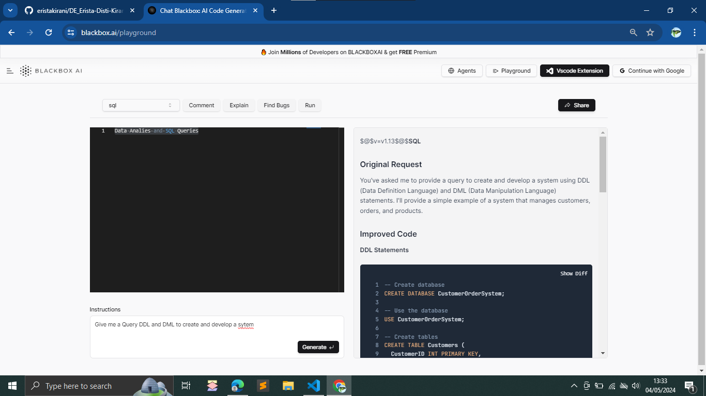

### **Soal Prioritas 1 (80)**

1. Pengenalan OpenAI Playground:
    - Buka OpenAI Playground di platform.openai.com/examples.
    - Pilih salah satu template yang relevan dengan Data Engineering, misalnya "Data Analysis" atau "SQL Queries".
2. Eksekusi dan Analisis:
    - Masukkan input yang berkaitan dengan analisis data atau query SQL.
    - Jalankan model AI dan amati output yang dihasilkan.
    
3. Dokumentasi:
    - Ambil screenshot hasil eksekusi di OpenAI Playground.
    - Copy-paste input dan output ke dalam file txt.
4. Penjelasan Hasil:
    - Buat penjelasan singkat mengenai bagaimana AI memproses input dan menghasilkan output.
    - Jelaskan potensi aplikasi hasil ini dalam konteks Data Engineering.

    **Penjelasan**
    - AI sudah sangat bagus ketika sudah diberikan suatu Prompt yang sesuai dengan Template yang sesuai. Jadi, keterjelasan penggunaan prompt atau perintah sebelum menggunakan AI dan juga Template nya itu sangat diperlukan.
    - Potensi dari aplikasi yang dihasilkan oleh AI ini cukup bisa memberikan bayangan mengenai bagaimana cara customer untuk membeli sesuatu, dan menampilkannya beserta dengan menyimpan datanya dalam database. Akan tetapi, belum begitu kompleks dikarenakan harus memerlukan analisis lebih lanjut berdasarkan perusahaan dan harus menggunakan Analisis dari Manusia dan bukan hanya menggunakan AI saja.