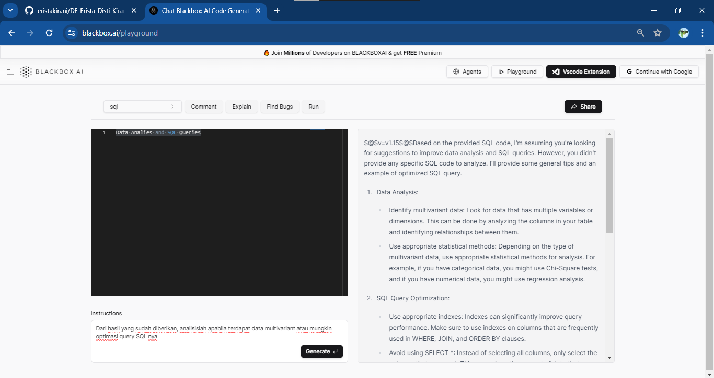

### Soal Prioritas **2 (20)**

1. Eksekusi Lanjutan:
    - Gunakan template yang lebih kompleks atau buat input yang lebih spesifik dan menantang, misalnya analisis data multivariat atau optimasi query SQL.
2. Analisis Mendalam:
    - Analisis bagaimana AI memproses input yang lebih kompleks.
    - Identifikasi kelebihan dan keterbatasan AI dalam kasus ini.
3. Dokumentasi dan Penjelasan:
    - Ambil screenshot hasil eksekusi lanjutan.
    
    - Copy-paste input dan output ke dalam file txt.
    - Buat penjelasan mendalam tentang hasil dan implikasinya dalam Data Engineering.

    **Penjelasan**
1. **Pemilihan Kolom yang Diperlukan**: Memilih kolom yang diperlukan daripada menggunakan `SELECT *` adalah praktik yang sangat baik dalam pengembangan data. Ini mengurangi overhead dalam memproses data karena hanya kolom yang benar-benar diperlukan yang diambil dari database. Dalam skala besar, hal ini dapat menghemat sumber daya server dan meningkatkan kinerja query secara keseluruhan.

2. **Penggunaan Filter yang Efisien**: Dengan menggunakan filter yang efisien seperti pada baris `WHERE o.order_date >= '2022-01-01' AND o.order_date <= '2022-12-31'`, query dapat memanfaatkan indeks yang ada pada kolom tanggal, yang akan mempercepat proses pencarian data. Selain itu, penambahan filter tambahan seperti `AND o.order_date >= DATEADD(month, -6, GETDATE())` memungkinkan kita untuk fokus pada data yang lebih baru, yang mungkin lebih relevan dalam banyak kasus.

3. **Optimisasi Penggunaan JOIN**: Dalam query, penggunaan JOIN harus dipertimbangkan dengan hati-hati karena dapat menyebabkan penurunan kinerja jika tidak dioptimalkan dengan baik. Dalam contoh ini, JOIN digunakan dengan baik dengan menggunakan indeks pada kolom `customer_id`. Selain itu, penambahan kondisi tambahan seperti `AND c.customer_type = 'Premium'` memungkinkan kita untuk membatasi hasil hanya pada pelanggan premium, yang dapat mengurangi jumlah baris yang dihasilkan.

4. **Penyempurnaan Perintah**: Implementasi perintah `ORDER BY` setelah menerapkan filter dapat membantu mengurangi beban pemrosesan pada database, terutama jika kita hanya tertarik pada subset tertentu dari data.

Implikasi dari optimisasi ini dalam konteks Data Engineering adalah:

- **Kinerja yang Ditingkatkan**: Dengan mengurangi jumlah data yang diproses dan mengoptimalkan query, waktu eksekusi dapat berkurang secara signifikan, yang penting dalam lingkungan produksi di mana waktu respons yang cepat menjadi kunci.
- **Efisiensi Sumber Daya**: Dengan mengurangi penggunaan sumber daya server, seperti memori dan CPU, organisasi dapat menghemat biaya infrastruktur dan meningkatkan skala aplikasi mereka tanpa harus meningkatkan infrastruktur secara signifikan.
- **Skalabilitas yang Ditingkatkan**: Dengan menggunakan praktik terbaik dalam penulisan query, aplikasi dapat dengan mudah diubah dan diperluas dengan mempertahankan kinerja yang optimal, bahkan saat volume data meningkat.

Dengan menerapkan optimisasi semacam ini, Data Engineer dapat membantu memastikan bahwa sistem dapat menangani beban kerja yang lebih besar dengan kinerja yang baik, sambil mengoptimalkan penggunaan sumber daya yang tersedia.